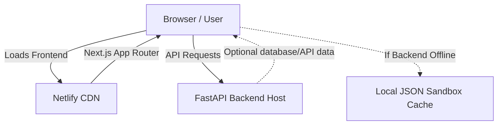

# Portfolio Deployment Guide (Netlify)

This guide walks you through deploying your AI/ML portfolio application to **Netlify** (for the frontend) and provides instructions on managing the connection with the FastAPI backend.

---

## Architecture Overview

The portfolio is architected to be highly resilient:
- **Frontend (Next.js):** Deployed to Netlify.
- **Backend (FastAPI):** Deployed to a service like Render, Railway, or Fly.io (since Netlify is static/serverless-only and does not host persistent Python servers).
- **Graceful Fallback:** If the backend is offline or not configured, the frontend automatically falls back to the local client-side data cache (`fallbackData.ts`) and displays a "**Sandbox**" status. When connected to the API, it displays "**API Live**".

---

## Step 1: Netlify Deployment Configuration

We have already configured your repository with two `netlify.toml` files:
1. **Root `netlify.toml`:** Directs Netlify to use `portfolio-system/frontend` as the base directory if you connect the entire repository.
2. **Frontend `netlify.toml` (`portfolio-system/frontend/netlify.toml`):** Configures build commands and environment settings directly for the Next.js build process.

### How to deploy:
1. Push your code to your GitHub/GitLab repository.
2. Log in to your **Netlify Dashboard**.
3. Click **Add new site** > **Import an existing project**.
4. Authorize your Git provider and select your repository.
5. Netlify will read the root `netlify.toml` and automatically fill in:
   - **Base directory:** `portfolio-system/frontend`
   - **Build command:** `npm run build`
   - **Publish directory:** `portfolio-system/frontend/.next`
6. Click **Deploy [site-name]**.

---

## Step 2: Configuring Environment Variables

To connect your deployed frontend to your backend API, you must configure the backend URL in Netlify:

1. In the Netlify dashboard, go to your site settings.
2. Navigate to **Site configuration** > **Environment variables**.
3. Add a new variable:
   - **Key:** `NEXT_PUBLIC_API_URL`
   - **Value:** `https://your-backend-api-url.com` (replace with your actual deployed FastAPI URL).
4. Trigger a new deploy (Netlify will rebuild your Next.js application with this environment variable baked in).

> [!NOTE]
> If you leave `NEXT_PUBLIC_API_URL` unset, the application will default to `http://localhost:8000` and automatically fall back to the built-in sandbox mock data if no server is running there.

---

## Step 3: Deploying the FastAPI Backend (Optional)

Since Netlify only hosts web applications and serverless JS/TS functions, the Python FastAPI backend needs to be deployed on a platform that supports running persistent Python servers.

### Recommended Free/Low-Cost Options:
- **Render** (e.g., Web Service deploying the `portfolio-system/backend` directory using the provided `Dockerfile` or `pip install -r requirements.txt`).
- **Railway**
- **Fly.io**

### Configuring CORS on the Backend:
Ensure that your backend allows CORS requests from your Netlify domain. In the FastAPI backend app, check that `CORSMiddleware` is configured to accept your Netlify site URL (e.g. `https://your-site.netlify.app`) in the `allow_origins` parameter.
